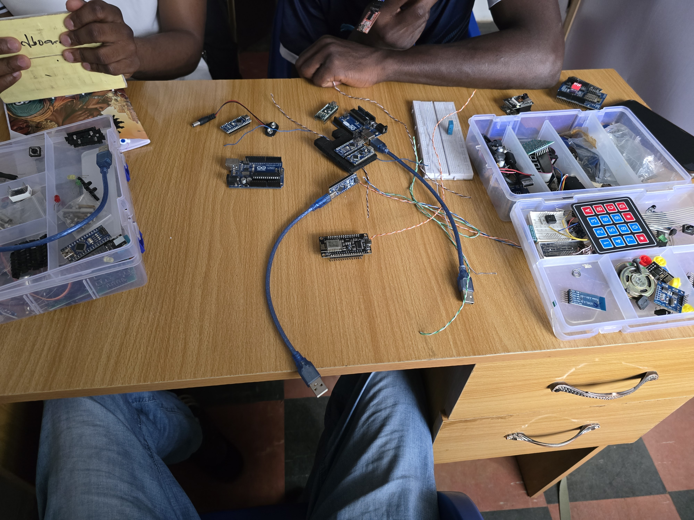
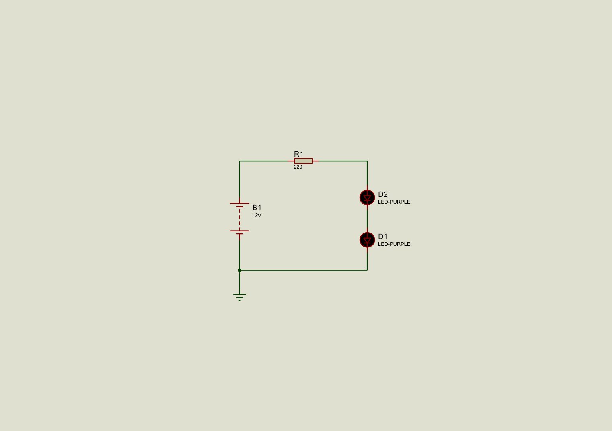

# Introduction to Microcontrollers and Proteus Simulation

## Date
August 24, 2025

## Objective
- Get familiar with different microcontrollers and development boards.  
- Learn the basics of using Proteus for circuit simulation.  
- Design and simulate a simple LED circuit.  

## Background
In this lesson, I was introduced to several microcontrollers and boards:  
- **Arduino Uno, Nano, Micro, Mini, Mega** → General-purpose prototyping boards.  
- **ESP8266, ESP32, ESP32-CAM** → Wi-Fi and Bluetooth-enabled IoT boards.  
- **FTDI Programmer** → Used for programming boards without built-in USB support.  

  

I also learned the basics of **Proteus**, a circuit simulation tool that helps test designs before moving to hardware.  

## Setup
- **Software:** Proteus  
- **Components used in simulation:** Power source, resistor, LED  

## Implementation
- Designed a simple circuit where an LED lights up when connected correctly.  
- Learned how to place components, connect wires, and run the simulation.  

**Simulation Screenshot:**  
  

*(The corresponding Proteus file is saved as `led_circuit.pdsprj` in this folder.)*  

## Observations
- The LED turned on successfully when the circuit was connected properly.  
- The resistor prevented damage to the LED by limiting current.  
- Proteus makes it easy to test basic logic before touching hardware.  

## Results
- Successfully simulated a basic LED ON circuit in Proteus.  

## Reflection
This lesson gave me a solid introduction to the boards I’ll use later and showed me how Proteus can be a powerful tool for testing circuits quickly.  

## Next Steps
- Try simulating a blinking LED using a microcontroller in Proteus.  
- Practice adding and configuring an Arduino in Proteus simulations.  
