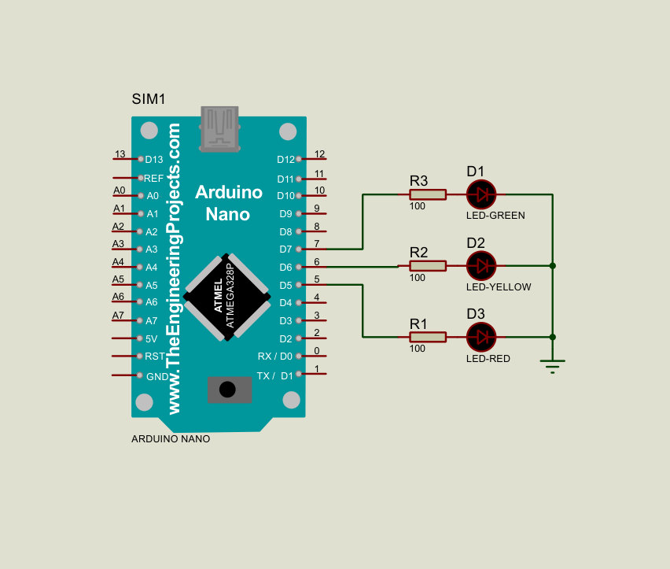

# Arduino Nano – LEDs and Buzzer Control

## Date
August 28, 2025

## Objective
- Learn how to program the Arduino Nano.  
- Turn on three separate LEDs using digital outputs.  
- Use a push button as input to trigger a buzzer.  

## Background
The **Arduino Nano** is a compact microcontroller board based on the ATmega328P.  
It has multiple digital I/O pins that can be programmed to control external components.  

Key concepts in this lesson:  
- **Digital Output** → Setting pins to HIGH/LOW to control LEDs.  
- **Digital Input** → Reading the state of a push button.  
- **Active Components** → Using a buzzer to produce sound when triggered.  

## Setup
- **Board:** Arduino Nano  
- **Software:** Arduino IDE  
- **Components:**  
  - 3 × LEDs (with current-limiting resistors ~220Ω)  
  - 1 × Push button  
  - 1 × Buzzer (active buzzer module or passive + driver circuit)  

## Circuit Diagram
  
  

## Implementation
*(The corresponding Proteus file is saved as `turn_on_led_using_arduino.pdsprj` in this folder.)* 

**Simulation Screenshot:**  
  

*(The corresponding Proteus file is saved as `three_led_setup.pdsprj` in this folder.)*  

## Observations
- LEDs successfully turned on sequentially.
- The buzzer activated only when the push button was pressed. 

## Results
- Gained practical experience with digital outputs (LEDs, buzzer) and digital input (push button).
- Understood how to use arduino code structure (setup() and loop()).

## Reflection
This lesson helped me transition from simulation to real hardware.
I now understand how inputs and outputs interact in embedded systems.

## Next Steps
- Combine LEDs + button + buzzer into a single project.
- Try more complex behaviors (e.g., button press cycles through LED patterns).