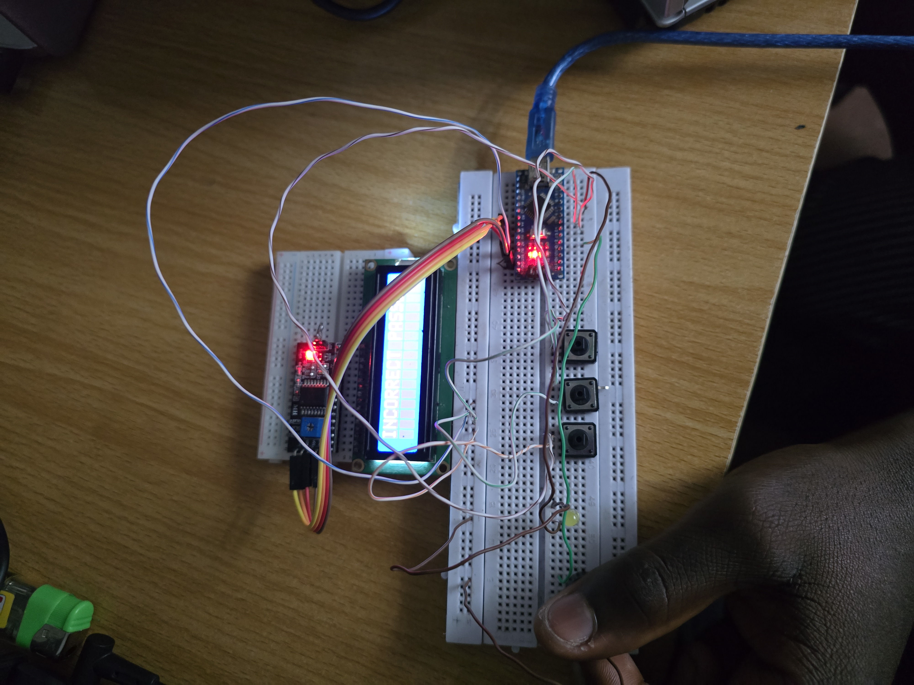

# Arduino Nano: Serial Communication & Password System

## Date
September 01, 2025

## Objective
- Learn about **serial communication** using Arduino Nano.  
- Implement a **button-based password system** with LCD, LED, and buzzer feedback.  

## Background
This lesson introduced:  
- **Serial Communication (`Serial.begin(9600)`):** Used for debugging and monitoring inputs/outputs.  
- **LCD Display (I2C):** Provided feedback messages (e.g., password correct, attempts exceeded).  
- **Push Buttons (Inputs):** Used to enter a sequence representing the password.  
- **Buzzer & LED (Outputs):** Indicated success/failure and lockout status.  

## Setup
- **Board:** Arduino Nano  
- **Components:**  
  - 3 × Push Buttons  
  - 1 × Buzzer  
  - 1 × LED  
  - 1 × I2C LCD (16x2, address `0x27`)  

## Circuit Picture

  

## Implementation
The system requires pressing a **sequence of 5 button inputs**.  

- `btn1` → Multiplies password by 8  
- `btn2` → Multiplies password by 7  
- `btn3` → Increments password by 1  

The correct sequence corresponds to a final password value of `10760`.  

## Full Code

*(Final code is called password_integer_three_buttons_with_lcd.ino)*  

## Observations

- Serial Monitor was useful for debugging inputs.
- LCD provided user-friendly feedback messages.
- Incorrect attempts triggered buzzer warnings.
- After 3 failed attempts, system locked out with buzzer ON.

## Results

- Implemented a 3-button password-based security system.
- Understood how state (digits pressed, attempts, password) can be tracked with variables.

## Reflection
This project was a big leap because it introduced:

- Serial communication debugging
- LCD + input + output integration
- Logic for security systems