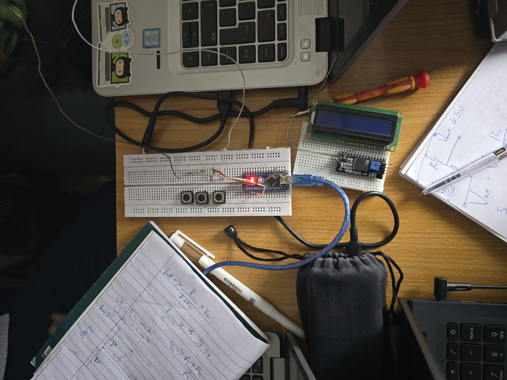

# Sensors Introduction & Voltage Monitoring System

## Date
September 08, 2025

## Objective
- Get familiar with different commonly used sensors.  
- Implement a **voltage monitoring system** using a voltage divider and Arduino Nano.  

## Background
### Sensors Introduced:
- **DHT11/DHT22:** Measure temperature and humidity. *(dht11.ino)*  
- **Fire Sensor:** Detects flames or infrared light from fire.  *(fire_sensor.ino)*
- **Gas Sensor (MQ series):** Detects gases like LPG, CO, smoke.  *(gas_sensor.ino)*
- **Proximity Sensor:** Detects nearby objects without physical contact.  *(proximity_sensor.ino)*

### Voltage Monitoring System:
- Uses a **voltage divider circuit** (resistors `R1` and `R2`) to scale down high voltage into Arduino’s measurable range (0–5 V).  
- Arduino reads the divided voltage at **analog pin A0**, then calculates the actual input voltage.  

## Setup
- **Board:** Arduino Nano  
- **Components:**  
  - DHT11 / DHT22  
  - Fire sensor module  
  - Gas sensor module  
  - Proximity sensor  
  - Resistors (1 kΩ, 2 kΩ)  
  - Breadboard, wires  

## Circuit Diagram 

  

## Implementation
### Code for Voltage Monitoring
*(Final code is called voltage_monitor.ino)* 

## Key Notes
 - analogRead(sensor) → Returns value (0–1023).
 - Scaled to voltage using (bat / 1023.0) * Vref.
 - Input voltage calculated using voltage divider formula.

## Observations
 - Voltage readings displayed on the Serial Monitor.
 - Accuracy depends on resistor precision and correct Vref.
 - Other introduced sensors were understood in theory but not yet programmed.

## Results
 - Successfully read and calculated actual supply voltage using Arduino.
 - Learned about interfacing analog sensors and interpreting voltage values.

## Reflection
This lesson tied together:
 - Understanding different types of sensors.
 - Using analog inputs to measure real-world quantities.
 - The concept of voltage scaling for safe microcontroller measurement.